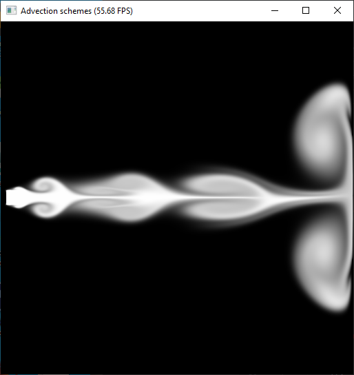
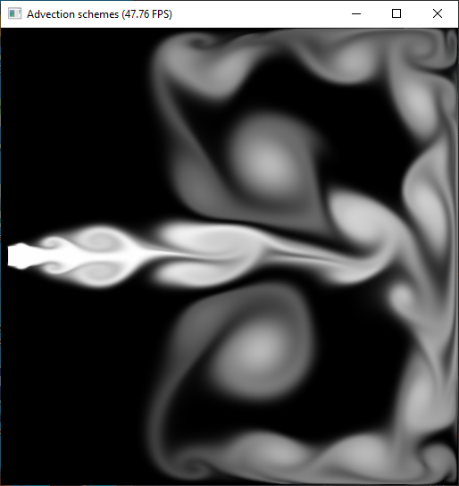

Jiarui Yan Taichi HW1 Eulerian Fluid:
======================

Jacobi method solver and Conjugate Gradient method solver.

Screen shot:
-------------

Videos:
-------------

Youtube: https://youtu.be/rBOZNeJZ6xo

Bilibili: https://www.bilibili.com/video/BV1354y1U7w9/

Reference:
-------------

https://forum.taichi.graphics/

advection.py, stable_fluid.py

http://developer.download.nvidia.com/books/HTML/gpugems/gpugems_ch38.html

https://github.com/tunabrain/incremental-fluids

